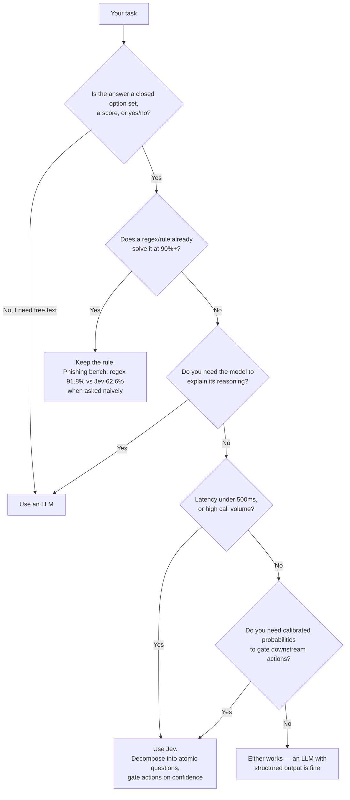

# Awesome Jev Guide

**The guide that answers "should I use Jev, and how" — not just another link directory.**

[English](README.md) | [简体中文](README.zh-CN.md) | 🌐 **[Web Version](https://dog-last.github.io/awesome-jev/)**

[](https://github.com/dog-last/awesome-jev/actions/workflows/ci.yml)
[](LICENSE)

> Jev is the first **System One model**, released by TypeSafe AI on 2026-09-15. It never generates text: you send a `state` plus typed questions, and get back structured, probability-calibrated decisions your code can branch on directly. Three primitives: **Choice** (pick from ≤255 options), **Score** (rate on a rubric), **Noul** (probability that a statement is true).

---

## Should you use Jev? — 60-second decision tree



The most expensive lesson from independent evals: **asking Jev one big vague question is the worst way to use it.** On a phishing benchmark, asking "should I click this?" scored 62.6% — worse than a regex (91.8%). Decomposing the same task into 5 atomic signals + logistic regression hit **95.0%**. "Question atomization" was worth 32 points. ([jev-phishing-bench](https://github.com/anisselbd/jev-phishing-bench))

---

## Quickstart (5 minutes)

Example adapted from the [official TypeSafe docs](https://docs.typesafe.ai/introduction). The commented outputs are from our own run against the live API on 2026-09-20.

```bash
# save the snippet as triage.py, then:
TYPESAFE_API_KEY=ts-your-key uv run --with typesafe-sdk triage.py
# get a key at https://typesafe.ai — or via Vercel AI Gateway (typesafe-ai/jev, no waitlist)
```

```python
from typesafe_sdk import Choice, Score, Noul, TypeSafeClient

client = TypeSafeClient()

response = client.system_one(
    state="Hi, my Stripe integration keeps failing for 3 days. I'm losing sales. Help ASAP.",
    questions={
        "department": Choice(
            instructions="Which team should handle this",
            criteria={"billing": "Payment issues", "technical": "Bugs or integrations", "sales": "Pricing"},
        ),
        "frustration": Score(instructions="How frustrated the customer appears",
                             criteria=["Calm", "Frustrated but civil", "Very angry"]),
        "is_urgent": Noul(instructions="The message conveys urgency"),
    },
)

print(response.answers["department"].choice)      # "technical"
print(response.answers["department"].confidence)  # 0.75 — gate your automation on this
print(response.answers["is_urgent"].noul)         # 0.99
```

> ✅ Every snippet in this repo runs against the live API — see [cookbooks/](cookbooks/) for full scripts with real outputs.

---

## Cookbooks — runnable, tested against the live API

Each script is a single self-contained pattern you can read in one sitting, and was executed against the real Jev API before being committed.

| # | Pattern | What you'll learn |
|---|---|---|
| [01](cookbooks/01_ticket_triage.py) | Ticket triage | Mix Choice + Score + Noul in **one parallel call** |
| [02](cookbooks/02_confidence_gated_guardrail.py) | Content guardrail | Atomic Noul checks + confidence-gated BLOCK/REVIEW/PASS |
| [03](cookbooks/03_rag_rerank.py) | RAG reranking | Score candidate chunks, sort, drop low-confidence |
| [04](cookbooks/04_composite_scoring.py) | Composite scoring | Decompose a big judgment, weight it in code, not in a prompt |

Run them:

```bash
cd cookbooks
cp .env.example .env   # paste your key
uv run 01_ticket_triage.py
```

---

## Use cases — what people are actually building

The ecosystem is five days old and already has hundreds of real apps. Stars as of 2026-09-20, moving fast. 🌐 [Browse the full directory](https://dog-last.github.io/awesome-jev/use-cases.html)

### Flagship demos

| Project | ★ | What it does |
|---|---|---|
| [browser-use/jev-ultrafast](https://github.com/browser-use/jev-ultrafast) | 10.1k | Browser agent where **one Jev call picks both action and target element**; an LLM is only called to type text. Booked a Zürich→London flight on Google Flights in **7.1 s end-to-end** |
| [tamaratran/fast-jev-compaction](https://github.com/tamaratran/fast-jev-compaction) | 4.5k | Claude Code plugin replacing summary-based compaction with per-item Jev keep/drop decisions — context stays verbatim (156k→62k tokens demo) |
| [vercel/eve](https://github.com/vercel/eve) | 5.3k | Vercel's agent framework ships Jev as the **default model** in its `evaluate` path |
| [OpenByteInc/QuantDinger](https://github.com/OpenByteInc/QuantDinger) | 11.8k | Open-source AI trading OS with a documented Jev pre-trade decision module |
| [typesafe-ai/skills](https://github.com/typesafe-ai/skills) | 853 | Official agent-skills package for building with the System One API |

### Browser, desktop & mobile agents

| Project | ★ | What it does |
|---|---|---|
| [Sac-Y/Jev-cu](https://github.com/Sac-Y/Jev-cu) | 391 | Jev picks element/action/risk inside Codex Computer Use — text-only, no screenshots |
| [wy-coliney/jev-browser-use](https://github.com/wy-coliney/jev-browser-use) | 217 | "Jev clicks, Codex thinks and verifies" — 5–10× faster browser ops |
| [jkudish/jev-browser](https://github.com/jkudish/jev-browser) | 164 | Browser-use driven by Jev decisions |
| [moritzkremb/jev-voice-browser](https://github.com/moritzkremb/jev-voice-browser) | 134 | Voice-controlled real browser; intent+target in ~300 ms per spoken word |
| [savka777/jev-use](https://github.com/savka777/jev-use) | 39 | Mac computer-use via Accessibility API + voice input |
| [skeptrunedev/jev-recruiter](https://github.com/skeptrunedev/jev-recruiter) | 33 | LinkedIn recruiting agent that browses profiles and saves candidates |
| [kevinbadi/jev-voice](https://github.com/kevinbadi/jev-voice) | 27 | whisper.cpp local STT + one Jev call per macOS command |

### Mobile use — Android / iOS agents & testing

| Project | ★ | What it does |
|---|---|---|
| [droidrun/mobile-jev](https://github.com/droidrun/mobile-jev) | 248 | Standalone Android agent (Mobilerun): Uber ride SFO→Golden Gate in ~21 s / 9 actions |
| [SomeshSampat2/jev-android-super](https://github.com/SomeshSampat2/jev-android-super) | 0 | On-device Kotlin/Compose agent; "open YouTube and subscribe to MrBeast" in 17 steps / ~32 s, ships an APK |
| [antiyro/jevdroid](https://github.com/antiyro/jevdroid) | 3 | Typed Python framework for Android over ADB; Jev reads the accessibility tree, 314 ms median decision latency |
| [gokulnair2001/Convoy](https://github.com/gokulnair2001/Convoy) | 2 | Semantic E2E testing for iOS/Android/web: YAML natural-language steps, Jev matches intent → control |
| [jaewgwon/jevis](https://github.com/jaewgwon/jevis) | 1 | Dart package on Flutter `integration_test`: describe a goal, Jev picks the next action |
| [ufec/jev-block-android-ad](https://github.com/ufec/jev-block-android-ad) | 3 | "JevNoiseGate": on-device notification/SMS noise filter, fail-open, codes never uploaded |
| [Baran3575/jev-voice-android](https://github.com/Baran3575/jev-voice-android) | 0 | Turkish voice-command app; one parallel Jev call → dial/SMS/alarms, confidence-gated at 0.60 |
| More | | [jevdroid-MCP](https://github.com/Xopher00/jevdevice) · [droidjev](https://github.com/mkruglikov/droidjev) (screenshot-free, ports the jev-ultrafast pattern) · [JevPilot](https://github.com/InfamousCube/JevPilot) (Windows+Android) · [jev-ios-ultrafast](https://github.com/Clueless-Creations/jev-ios-ultrafast) · [jevium](https://github.com/aldouus/jevium) (Appium) |

### Games

| Project | ★ | What it does |
|---|---|---|
| [fhshaik/typesafe-mario](https://github.com/fhshaik/typesafe-mario) | 289 | Plays Super Mario Bros from structured emulator RAM — no screenshots |
| [standardagents/jevpilot](https://github.com/standardagents/jevpilot) | 102 | Three.js driving simulator with Jev autopilot, hosted demo |
| [rmalde/minecraft-agent](https://github.com/rmalde/minecraft-agent) | 75 | Astra plans, Jev controls, with route verification |
| [sorrycc/typesafe-snake](https://github.com/sorrycc/typesafe-snake) | 18 | Snake, one Choice per tick — by UmiJS creator sorrycc |
| [ickas/battleship-vs-jev](https://github.com/ickas/battleship-vs-jev) | 0 | 60-game study with live probability heatmaps; hybrid Jev ≈ density baseline |
| [pokertools-arena](https://github.com/pokertools-arena/pokertools-arena.github.io) | 1 | No-limit Hold'em bench seating Jev vs OpenAI-compatible models |
| More | | [jevball](https://github.com/atarikcaliskan/jevball) (22 players = 22 calls) · [typesafe-chess](https://github.com/Dimesio/typesafe-chess) · [jev-plays-pokemon](https://github.com/milanboers/jev-plays-pokemon) · [tetris-jev](https://github.com/chahero/tetris-jev) |

### Dev tooling & agent infrastructure

| Project | ★ | What it does |
|---|---|---|
| [thruwire/foreman](https://github.com/thruwire/foreman) | 413 | "Software factory foreman" orchestrating dev work via Jev |
| [devagrawal09/jev-review](https://github.com/devagrawal09/jev-review) | 376 | Staged code-review workflow + local dashboard driven by Jev judgments |
| [gargpratyush/jev-router](https://github.com/gargpratyush/jev-router) | 229 | Routes each Claude Code task to the cheapest adequate model |
| [NiazMorshed2007/jev-review](https://github.com/NiazMorshed2007/jev-review) | 175 | Local-first MCP plugin for continuous quality review |
| [lakeday-org/perch](https://github.com/lakeday-org/perch) | 161 | Semantic code linting with Jev |
| [tamaratran/jev-pruner](https://github.com/tamaratran/jev-pruner) | 119 | Trims long Bash output before the model sees it |
| [uehaj/jev-semgrep](https://github.com/uehaj/jev-semgrep) | 103 | "grep by meaning" with composable AND/OR meaning queries |
| [BillionsBobby/JevRouter](https://github.com/BillionsBobby/JevRouter) | 98 | Routes models, tools, and subagents |
| [y0usaf/pi-jev](https://github.com/y0usaf/pi-jev) | 101 | Decision layer for the Pi agent: tool-call gate + `jev_ask` |
| [vinilana/jev-eval-agent](https://github.com/vinilana/jev-eval-agent) | 95 | Measures steps saved when Jev (not the LLM) picks tools |
| [0xNatoshi/jev-codex-router](https://github.com/0xNatoshi/jev-codex-router) | 76 | Per-turn model / reasoning-depth routing for Codex |
| [mrnugget/jev-shell-history](https://github.com/mrnugget/jev-shell-history) | 68 | Fish-style zsh autosuggestions ranked by Jev |
| [vinilana/jev-gateway](https://github.com/vinilana/jev-gateway) | 61 | Local gateway where Jev makes tool-choice for Codex/Claude Code/OpenCode |
| [w3cj/jev-chat](https://github.com/w3cj/jev-chat) | 49 | Tool-calling chatbot with **no LLM** — Jev picks intent/tool/args each turn |
| [fatwang2/jev-review-action](https://github.com/fatwang2/jev-review-action) | 1 | Reusable GitHub Action: Jev reviews PR/submission classifications |
| More | | [jev-shell](https://github.com/Dicklesworthstone/skillranker) skill ranking · [jev-axi](https://github.com/shiftynick/jev-axi) CLI · [jev-cli](https://github.com/Nasrallah-AL/jev-cli) · [winnow](https://github.com/GhalebDweikat/winnow) context sieve · [jev-lint](https://github.com/mizchi/jev-lint) · [commit-miner](https://github.com/devanshbatham/commit-miner) · [jegrep](https://github.com/can1357/jegrep) · [blink](https://github.com/ellipsis-dev/blink) |

### Guardrails, moderation & security

| Project | ★ | What it does |
|---|---|---|
| [kitze/unclutter](https://github.com/kitze/unclutter) | 138 | Browser extension for Jev-powered page-clutter removal with reusable rules |
| [DevMortimer/pi-warden](https://github.com/DevMortimer/pi-warden) | 99 | Guardrails for the Pi coding agent; Jev judges irreversibility and steers |
| [trungdq88/youtube-sponsor-detection](https://github.com/trungdq88/youtube-sponsor-detection) | 74 | Finds sponsor reads in videos and skips them |
| [realZachi/typesafe-adblock](https://github.com/realZachi/typesafe-adblock) | 58 | Chrome extension asking Jev "is this DOM element an ad?" |
| [brainstormity/Jev-Moderation-Bot](https://github.com/brainstormity/Jev-Moderation-Bot) | 36 | Discord bot: real-time spam/scam filtering and escalation |
| [RafalWilinski/vibecheck](https://github.com/RafalWilinski/vibecheck) | 42 | Vibe-checks your X posts before you send them |
| [jomatsu/pi-jev-auto-mode](https://github.com/jomatsu/pi-jev-auto-mode) | 17 | Semantic auto-approval of bash commands |
| More | | [jev-guard](https://github.com/leepokai/jev-guard) tool-call risk scoring · [pi-jev-sentinel](https://github.com/harshwasan/pi-jev-sentinel) injection screening · [jev-prompt-sentry](https://github.com/ca7ai/jev-prompt-sentry) LLM firewall · [jev-pii-guardrail](https://github.com/jms-dcksn/jev-pii-guardrail) UiPath PII |

### Search, RAG & classification

| Project | ★ | What it does |
|---|---|---|
| [superagents-lab/jev-search](https://github.com/superagents-lab/jev-search) | 260 | Full web-search pipeline: source selection, query understanding, ranking |
| [kbhuw/jev-sift](https://github.com/kbhuw/jev-sift) | 46 | Batch classification MCP — "classify first, read selectively" |
| [brainstormity/Jev-X-Sentiment-Analysis](https://github.com/brainstormity/Jev-X-Sentiment-Analysis) | 80 | 50–1000 crypto tweets → Buy/Sell/Hold terminal |
| [zhuyansen/jev-search-rerank-eval](https://github.com/zhuyansen/jev-search-rerank-eval) | 4 | zh/en rerank eval, 9,831 pairs: Jev ≈ bge-m3 alone, **RRF fusion +0.090 NDCG** |
| More | | [jev-recall](https://github.com/samdotmak/jev-recall) memory filter · [invalidate](https://github.com/chopratejas/invalidate) memory invalidation · [jev-curate](https://github.com/AkashPriyadarshii/jev-curate) dataset sifting · [jevmail](https://github.com/fazlerocks/jevmail) Gmail triage |

### Finance & compliance

| Project | ★ | What it does |
|---|---|---|
| [jarrodwatts/jev-trader](https://github.com/jarrodwatts/jev-trader) | 1.4k | One AI trade decision every block on Monad, by an ex-thirdweb engineer |
| [kyotofin/tax-doc-classifier](https://github.com/kyotofin/tax-doc-classifier) | 281 | IRS tax-form page classifier: 261 form types, 100% strict accuracy at ~$0.001/page |
| [aowang-ai/jev-trade](https://github.com/aowang-ai/jev-trade) | 30 | Live Jev trader on Hyperliquid |
| [myc0576/SmartMoney-Cub](https://github.com/myc0576/SmartMoney-Cub) | 24 | Trading journal + typed-judgment review harness |

### Robotics, IoT & smart home

| Project | ★ | What it does |
|---|---|---|
| [rokbenko/quackd](https://github.com/rokbenko/quackd) | 217 | One CLI for robot fleets with per-robot decision models |
| [RomanSlack/jev-drone](https://github.com/RomanSlack/jev-drone) | 81 | Camera-only autonomous quadrotor in MuJoCo; Jev at 2.5 Hz decides "what the situation means" while code owns control |
| [AboveColin/HA-Jev](https://github.com/AboveColin/HA-Jev) | 27 | Home Assistant integration — "ask your house a question, get a number back", with token-budget kill switch |
| [arielweinberger/jev-autopilot](https://github.com/arielweinberger/jev-autopilot) | 5 | Jev flies a drone point-to-point in a random city |

### Databases & data tooling

| Project | ★ | What it does |
|---|---|---|
| [realZachi/pg-jev](https://github.com/realZachi/pg-jev) | 228 | PostgreSQL extension: ask tables questions in plain language |
| [pithings/advocaat](https://github.com/pithings/advocaat) | 85 | Typed client for asking AI questions about your data |
| [giuliosmall/pg_typesafe](https://github.com/giuliosmall/pg_typesafe) | 79 | PG extension for categorical classification |
| [jexp/neo4jev](https://github.com/jexp/neo4jev) | 43 | Jev navigates a Neo4j graph by classifying neighbouring relations (by Neo4j's Michael Hunger) |
| More | | [jevql](https://github.com/kylemclaren/jevql) `jev()` filters for Postgres · [vgi-typesafe](https://github.com/Query-farm/vgi-typesafe) DuckDB · [sqlite-jev](https://github.com/mgaitan/sqlite-jev) |

### SDKs, MCP & integrations

- **Official**: Python/JS SDKs · [typesafe-ai/system-one-adapter-python](https://github.com/typesafe-ai/system-one-adapter-python) (LLM-backed drop-in comparison adapter)
- **MCP servers**: [jkudish/jev-mcp](https://github.com/jkudish/jev-mcp) (129★) · [itsmostafa/typesafe-mcp](https://github.com/itsmostafa/typesafe-mcp) (123★, Go single binary) · [burnigtm/jev-mcp](https://github.com/burnigtm/jev-mcp) · [tacticocc/Jevbridge](https://github.com/tacticocc/Jevbridge) (ACP+MCP bridge)
- **Community SDKs**: [obie/ruby_decision_model](https://github.com/obie/ruby_decision_model) (Ruby, by Obie Fernandez) · [dannote/jev](https://github.com/dannote/jev) (Elixir/OTP) · [Twister915/typesafe-ai](https://github.com/Twister915/typesafe-ai) (Rust) · plus Go, Java/Kotlin, Swift, .NET, PHP/Laravel, Scala community clients
- **Frameworks**: [yusukebe/hono-jev-router](https://github.com/yusukebe/hono-jev-router) (semantic HTTP routing, by Hono's creator) · [llama-index-jev](https://github.com/WiktorB2004/llama-index-jev) (reranker, nDCG@5 0.340→0.396) · [typesafe_agent_gates](https://github.com/ThiagaoBR/typesafe_agent_gates) (LangChain middleware) · n8n nodes ([vibe-with-me-tools](https://github.com/vibe-with-me-tools/n8n-nodes-jev))
- **Gateways & hybrids**: [RyanKung/rotom](https://github.com/RyanKung/rotom) · [new-api-plugin-typesafe](https://github.com/FFatTiger/new-api-plugin-typesafe) · [kushals256/jevcache](https://github.com/kushals256/jevcache) (skip the LLM when intent matches) · [compozy/yoshi](https://github.com/compozy/yoshi) (context-pruning proxy)

---

## Cost & latency at a glance

Static facts, sourced, as of 2026-09. Verify against [official docs](https://docs.typesafe.ai/models) before budgeting.

| | Jev | Frontier LLM (vendor-claimed comparison) |
|---|---|---|
| Latency | 70–500 ms | 3–329 s |
| Input price | $0.042 / M tokens | typically $1–15 / M tokens |
| Output price | **free** (no text generated) | per-token |
| Rate limit | 250k tok/s, 1200 req/min | varies |

**Cost formula:** `monthly $ = daily calls × avg state tokens × 30 × 0.042 / 1,000,000`

Example: 100k calls/day × 500-token state = 1.5B tokens/month → **$63/month**. The official Doom demo queried 10×/second at ~$7/hour.

⚠️ The "193× faster / 444× cheaper" figures are vendor self-assessments with non-comparable methodology; the real, third-party-confirmed edges are **latency, cost, calibrated distributions, and drift robustness** (spam eval: 97.3% under drift vs TF-IDF's 72.5% — [jev-spam-eval](https://github.com/bitnovus/jev-spam-eval)).

---

## Official resources

- [Introducing System One Models and Jev](https://typesafe.ai/blog/introducing-system-one-models-and-jev) — launch post by TypeSafe AI
- [Documentation](https://docs.typesafe.ai/introduction) — primitives, confidence, patterns
- [Patterns](https://docs.typesafe.ai/patterns) — speculative fan-out, confidence-gated routing, composite scoring, intent routing
- [Confidence](https://docs.typesafe.ai/confidence) — how to threshold certainty architecturally
- API endpoint: `POST https://api.typesafe.ai/v1/systemone` · SDKs: Python / JS

## Open-source reproductions

Jev is closed-weight, but the community reverse-engineered the inference shape in days. The training side (RLCD calibration) is the real moat.

| Project | ★ | Why it's worth your time |
|---|---|---|
| [TheoLeeCJ/SemIf](https://github.com/TheoLeeCJ/SemIf) | 2.1k | Zero-training "semantic if" on an RTX 3090: read option logits from Qwen3.5-4B. 20 decisions/s with shared-prefix reuse; 0.845 agreement vs Jev's 0.883 on the public subset |
| [vinnylarouge/jevlike](https://github.com/vinnylarouge/jevlike) | 1k | The first viral reimplementation; options-as-queries attention pooling. Explicitly *not* an RLCD reproduction |
| [TianyuCodings/NanoJev](https://github.com/TianyuCodings/NanoJev) | 1.2k | 0.6B end-to-end training pipeline with paired proper-reward learning — closest public thing to RLCD. Chinese-friendly docs, weights + data on HF |
| [jaredpalmer/kev](https://github.com/jaredpalmer/kev) | 692 | API-compatible with `/v1/systemone`. The money stat: −1.8pp in-distribution but **−19.1pp OOD** vs real Jev — proof calibration training is the moat |
| [arnabgho/rlcd-lite](https://github.com/arnabgho/rlcd-lite) | 1 | GRPO + Brier reward reimplementation; key ablation: proper-scoring-rule rewards produce calibration, binary rewards destroy it |
| [DECRUX9812/openjev-lm](https://github.com/DECRUX9812/openjev-lm) | 1 | Cheapest entry point: LoRA on CPU in 89 min at $0, 92.9% answer agreement with the API |

## Inference-layer reimplementations (no training)

- [ekzhang/openjev-sglang](https://github.com/ekzhang/openjev-sglang) — Qwen3.6-35B-A3B + SGLang, prefill-only with radix cache, full official HTTP API
- [AlexWortega/openjev](https://huggingface.co/AlexWortega/openjev) — first open weights; Qwen3.5-4B as a 3-class NLI cross-encoder, zero-shot Doom
- [bnsd55/jevmlx](https://github.com/bnsd55/jevmlx) — Apple Silicon MLX · [r-ms/mini-jev](https://github.com/r-ms/mini-jev) — frozen Qwen3-4B, option-letter logits
- [Trecto34/openjev-fighting-ring](https://github.com/Trecto34/openjev-fighting-ring) — puts Diffusion/RLCD/Block-Causal/NLI approaches in one arena

## Independent evaluations (read before you believe any claim)

Large-scale / pre-registered studies:

| Evaluation | Finding |
|---|---|
| [willkelly/jev-evaluation](https://github.com/willkelly/jev-evaluation) | 9 adversarial experiments, 123,805 requests, $12.69: calibration ECE 0.075 in-domain but **fails OOD** (random 3-SAT); polite authority injection moves 147/200 answers; batching to 255 questions is genuinely free |
| [exs-brady/jev-eval-evidence](https://github.com/exs-brady/jev-eval-evidence) | 55,347 typed judgments, Jev vs 10 LLMs + keyword/regex floors, pre-registered with a blind cross-family replication |
| [ickma2311/jev-baselines-eval](https://github.com/ickma2311/jev-baselines-eval) | Banking77/CLINC150: Jev 0.832/0.870, but a 9 ms bge-small + logistic-regression baseline hits **0.933**; measured latency only 2.2× vs a nano-LLM — classical baselines still win some lanes |
| [Fox-Islam/jev-bias-bench](https://github.com/Fox-Islam/jev-bias-bench) | Counterfactual bias bench, 11,984 calls: 29 persona attributes across hiring/lending/clinical/bail scenarios, with noise floors and negative controls |
| [kokuren333/jev-jmle-benchmark](https://github.com/kokuren333/jev-jmle-benchmark) | 9 years of Japanese Medical Licensing Exams (3,556 items): **88.58%**; companion manuscript on medRxiv |
| [scienthoon/jev-ood-calibration](https://github.com/scienthoon/jev-ood-calibration) | OpenBookQA 94.2% / ECE 0.024, but on an unknowable rule-based task 44.7% acc with stated p 0.74 — miscalibration sign flips by question type |
| [EmilLindfors/jev-horingssvar-eval](https://github.com/EmilLindfors/jev-horingssvar-eval) | Norwegian hearing documents: equal accuracy to DeepSeek V4.1 Flash at **$0.22 vs $3.08 / 1k docs**, 0.32 s vs 26 s median |

Focused task evals:

| Evaluation | Finding |
|---|---|
| [anisselbd/jev-phishing-bench](https://github.com/anisselbd/jev-phishing-bench) | Naive question: 62.6% (regex: 91.8%). Atomic decomposition + logistic regression: **95.0%** |
| [bitnovus/jev-spam-eval](https://github.com/bitnovus/jev-spam-eval) | 98.3% on 18.5k emails ≈ TF-IDF, but **97.3% vs 72.5% under distribution drift** — drift robustness is the real edge |
| [mahlernim/jev-korean-benchmark](https://github.com/mahlernim/jev-korean-benchmark) | Reading comprehension nearly lossless; input reordering changes 13–14% of answers |
| [rorshopping/jev-on-a-laptop](https://github.com/rorshopping/jev-on-a-laptop) | A 1.5B model can't write 28-field JSON but makes 28 schema-valid decisions in 0.4s; 7B is the sweet spot |
| [jev-poker](https://backnotprop.com/blog/jev-poker/) | Only 63% agreement with a solver, inverted confidence — feed it pre-digested intermediate conclusions |

## Deep dives & reports

- [Jev in the Wild: A Data-Driven Analysis of the Jev Model's Functionality, Applications and Ecosystem](https://arxiv.org/abs/2609.30216) — Data-driven survey of 2,170 public GitHub Jev projects, documenting rapid early growth, application domains, and decision-use patterns; repository counts are not deployment counts.
- [HackSing/jev-report](https://github.com/HackSing/jev-report) — 52-page independent research report (中文)
- [掘金: 发布 3 天登顶 HN，我把 Jev 的源码和黑料都扒了一遍](https://juejin.cn/post/7686669083098775562) — Vercel AI SDK source dive (中文)
- [ic.work: TypeSafe 发布 Jev 模型](https://www.ic.work/article/typesafe-releases-jev-system-one-model) — skeptical take (中文)

## Other awesome lists

- [Anil-matcha/awesome-jev-by-typesafe](https://github.com/Anil-matcha/awesome-jev-by-typesafe) — the biggest directory; strict evidence-backed submission rules
- [yibie/awesome-jev](https://github.com/yibie/awesome-jev) — the most rigorous curation, explicit inclusion criteria
- [yzfly/awesome-jev-zh](https://github.com/yzfly/awesome-jev-zh) — the Chinese list, updated daily, honest about negative results
- [AbdelStark/awesome-typesafe](https://github.com/AbdelStark/awesome-typesafe) — wider TypeSafe ecosystem scope

---

## Contributing

Contributions welcome — especially: runnable cookbook patterns, independent eval results, and Chinese-scenario benchmarks (a known gap in the ecosystem). See [CONTRIBUTING.md](CONTRIBUTING.md). Inclusion here ≠ endorsement; vendor numbers are dated and sourced.

## License

[MIT](LICENSE)
