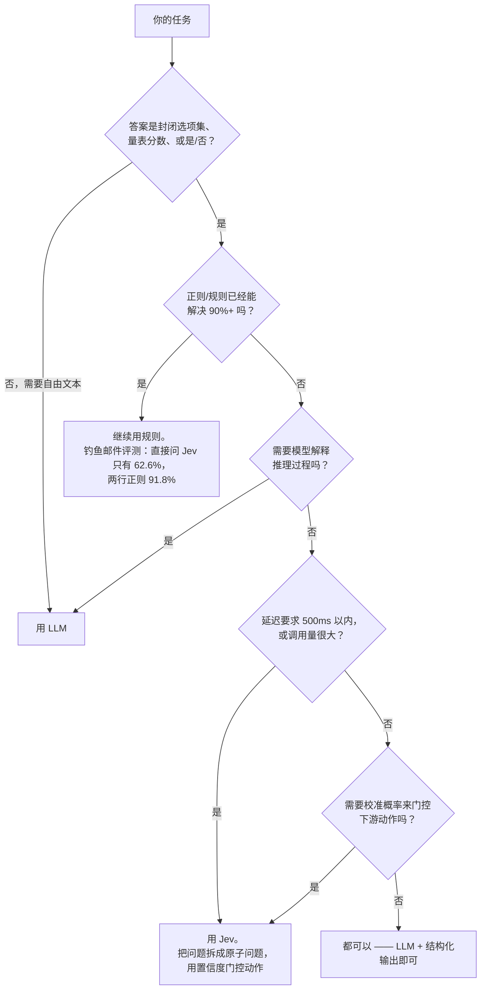

# Awesome Jev 实战指南

**回答"该不该用 Jev、怎么用"的指南型清单 —— 不是又一个链接目录。**

[English](README.md) | [简体中文](README.zh-CN.md) | 🌐 **[网页版](https://dog-last.github.io/awesome-jev/)**

[](https://github.com/dog-last/awesome-jev/actions/workflows/ci.yml)
[](LICENSE)

> Jev 是 TypeSafe AI 于 2026-09-15 发布的首个 **System One 模型**。它完全不生成文本：你发送 `state`（状态）+ 类型化问题，它返回带校准概率的结构化决策，代码可以直接分支使用。三大原语：**Choice**（从 ≤255 个选项中选一个）、**Score**（按量表打分）、**Noul**（某陈述为真的 0–1 概率）。

---

## 该不该用 Jev？—— 60 秒决策树



独立评测中最贵的教训：**把一个模糊的大问题直接丢给 Jev 是最差的用法。** 钓鱼邮件基准上，直接问"该不该点"只有 62.6% —— 不如两行正则（91.8%）。但拆成 5 个原子信号 + 逻辑回归后达到 **95.0%**。"问题原子化"值 32 个点。（[jev-phishing-bench](https://github.com/anisselbd/jev-phishing-bench)）

---

## 快速上手（5 分钟）

示例改写自 [TypeSafe 官方文档](https://docs.typesafe.ai/introduction)；注释中的输出是我们 2026-09-20 对真实 API 实测的结果。

```bash
# 把上面代码保存为 triage.py，然后：
TYPESAFE_API_KEY=ts-your-key uv run --with typesafe-sdk triage.py
# key 在 https://typesafe.ai 申请，或走 Vercel AI Gateway（typesafe-ai/jev，免排队）
```

```python
from typesafe_sdk import Choice, Score, Noul, TypeSafeClient

client = TypeSafeClient()

response = client.system_one(
    state="Hi, my Stripe integration keeps failing for 3 days. I'm losing sales. Help ASAP.",
    questions={
        "department": Choice(
            instructions="Which team should handle this",
            criteria={"billing": "Payment issues", "technical": "Bugs or integrations", "sales": "Pricing"},
        ),
        "frustration": Score(instructions="How frustrated the customer appears",
                             criteria=["Calm", "Frustrated but civil", "Very angry"]),
        "is_urgent": Noul(instructions="The message conveys urgency"),
    },
)

print(response.answers["department"].choice)      # "technical"
print(response.answers["department"].confidence)  # 0.75 —— 用置信度门控自动化
print(response.answers["is_urgent"].noul)         # 0.99
```

> ✅ 本仓库每段代码都真实跑通过 API —— 完整脚本和真实输出见 [cookbooks/](cookbooks/)。

---

## Cookbook —— 可运行、经真实 API 验证

每个脚本都是一个可一口气读完的独立模式，提交前都对真实 Jev API 执行过。

| # | 模式 | 你会学到 |
|---|---|---|
| [01](cookbooks/01_ticket_triage.py) | 工单分类路由 | Choice + Score + Noul 混合在**一次并行调用**中 |
| [02](cookbooks/02_confidence_gated_guardrail.py) | 内容护栏 | 原子 Noul 检查 + 置信度门控的 BLOCK/REVIEW/PASS |
| [03](cookbooks/03_rag_rerank.py) | RAG 重排 | 给候选 chunk 打分、排序、丢弃低置信结果 |
| [04](cookbooks/04_composite_scoring.py) | 组合评分 | 把大判断拆成原子维度，权重写在代码里而不是 prompt 里 |

运行方式：

```bash
cd cookbooks
cp .env.example .env   # 填入你的 key
uv run 01_ticket_triage.py
```

---

## 用例 —— 大家实际在构建什么

生态才五天大，已经有数百个真实应用。Star 数为 2026-09-20 时点数据，仍在快速变动。🌐 [浏览完整目录](https://dog-last.github.io/awesome-jev/use-cases.html)

### 旗舰级演示

| 项目 | ★ | 做什么 |
|---|---|---|
| [browser-use/jev-ultrafast](https://github.com/browser-use/jev-ultrafast) | 10.1k | 浏览器智能体：**一次 Jev 调用同时选出动作和目标元素**，LLM 只在需要输入文字时才调用。在 Google Flights 上订苏黎世→伦敦机票**端到端 7.1 秒** |
| [tamaratran/fast-jev-compaction](https://github.com/tamaratran/fast-jev-compaction) | 4.5k | Claude Code 插件：用逐条 Jev 保留/丢弃决策替代摘要式压缩 —— 上下文保持原文（演示 156k→62k token） |
| [vercel/eve](https://github.com/vercel/eve) | 5.3k | Vercel 智能体框架，Jev 是其 `evaluate` 路径的**默认模型** |
| [OpenByteInc/QuantDinger](https://github.com/OpenByteInc/QuantDinger) | 11.8k | 开源 AI 交易操作系统，内置文档化的 Jev 盘前决策模块 |
| [typesafe-ai/skills](https://github.com/typesafe-ai/skills) | 853 | 官方智能体技能包，教 agent 使用 System One API |

### 浏览器、桌面与移动智能体

| 项目 | ★ | 做什么 |
|---|---|---|
| [Sac-Y/Jev-cu](https://github.com/Sac-Y/Jev-cu) | 391 | 在 Codex Computer Use 中由 Jev 选择元素/动作/风险 —— 纯文本，无截图 |
| [wy-coliney/jev-browser-use](https://github.com/wy-coliney/jev-browser-use) | 217 | "Jev 点击，Codex 思考与验证" —— 浏览器操作快 5–10 倍 |
| [jkudish/jev-browser](https://github.com/jkudish/jev-browser) | 164 | 由 Jev 决策驱动的浏览器智能体 |
| [moritzkremb/jev-voice-browser](https://github.com/moritzkremb/jev-voice-browser) | 134 | 语音控制真实浏览器；每个语音指令约 300ms 内决定意图+目标 |
| [savka777/jev-use](https://github.com/savka777/jev-use) | 39 | 通过 Accessibility API + 语音输入的 Mac 桌面操控 |
| [skeptrunedev/jev-recruiter](https://github.com/skeptrunedev/jev-recruiter) | 33 | 浏览领英档案并保存候选人的招聘智能体 |
| [kevinbadi/jev-voice](https://github.com/kevinbadi/jev-voice) | 27 | whisper.cpp 本地语音转写 + 每条命令一次 Jev 调用的 macOS 自动化 |

### 移动方向 —— Android / iOS 智能体与测试

| 项目 | ★ | 做什么 |
|---|---|---|
| [droidrun/mobile-jev](https://github.com/droidrun/mobile-jev) | 248 | 独立 Android 智能体（Mobilerun）：Uber 打车 SFO→金门大桥约 21 秒 / 9 步 |
| [SomeshSampat2/jev-android-super](https://github.com/SomeshSampat2/jev-android-super) | 0 | 端侧 Kotlin/Compose 智能体；"打开 YouTube 订阅 MrBeast"17 步约 32 秒，附 APK |
| [antiyro/jevdroid](https://github.com/antiyro/jevdroid) | 3 | 基于 ADB 的类型化 Python 安卓控制框架；Jev 读无障碍树，决策中位延迟 314ms |
| [gokulnair2001/Convoy](https://github.com/gokulnair2001/Convoy) | 2 | iOS/Android/Web 语义化端到端测试：YAML 自然语言步骤，Jev 匹配意图→控件 |
| [jaewgwon/jevis](https://github.com/jaewgwon/jevis) | 1 | 基于 Flutter `integration_test` 的 Dart 包：描述目标，Jev 选下一步动作 |
| [ufec/jev-block-android-ad](https://github.com/ufec/jev-block-android-ad) | 3 | "JevNoiseGate"：端侧通知/短信噪音过滤，fail-open 设计，验证码不出设备 |
| [Baran3575/jev-voice-android](https://github.com/Baran3575/jev-voice-android) | 0 | 土耳其语语音指令应用；一次并行 Jev 调用 → 拨号/短信/闹钟，置信度 0.60 门控 |
| 更多 | | [jevdevice](https://github.com/Xopher00/jevdevice)（MCP 控制真机）· [droidjev](https://github.com/mkruglikov/droidjev)（无截图，移植 jev-ultrafast 模式）· [JevPilot](https://github.com/InfamousCube/JevPilot)（Windows+Android）· [jev-ios-ultrafast](https://github.com/Clueless-Creations/jev-ios-ultrafast) · [jevium](https://github.com/aldouus/jevium)（Appium） |

### 游戏

| 项目 | ★ | 做什么 |
|---|---|---|
| [fhshaik/typesafe-mario](https://github.com/fhshaik/typesafe-mario) | 289 | 读模拟器 RAM 结构化状态玩超级马里奥 —— 无截图 |
| [standardagents/jevpilot](https://github.com/standardagents/jevpilot) | 102 | Three.js 驾驶模拟器 + Jev 自动驾驶，有在线 demo |
| [rmalde/minecraft-agent](https://github.com/rmalde/minecraft-agent) | 75 | Astra 规划、Jev 控制玩 Minecraft，带路线验证 |
| [sorrycc/typesafe-snake](https://github.com/sorrycc/typesafe-snake) | 18 | 每 tick 一次 Choice 玩贪吃蛇 —— 作者是 UmiJS 创始人 sorrycc（云谦） |
| [ickas/battleship-vs-jev](https://github.com/ickas/battleship-vs-jev) | 0 | 60 局海战棋研究 + 实时概率热力图；混合策略 ≈ 密度基线 |
| [pokertools-arena](https://github.com/pokertools-arena/pokertools-arena.github.io) | 1 | 无限注德州扑克基准，Jev 对阵 OpenAI 兼容模型 |
| 更多 | | [jevball](https://github.com/atarikcaliskan/jevball)（22 名球员 = 22 次调用）· [typesafe-chess](https://github.com/Dimesio/typesafe-chess) · [jev-plays-pokemon](https://github.com/milanboers/jev-plays-pokemon) · [tetris-jev](https://github.com/chahero/tetris-jev) |

### 开发工具与智能体基础设施

| 项目 | ★ | 做什么 |
|---|---|---|
| [thruwire/foreman](https://github.com/thruwire/foreman) | 413 | "软件工厂工头"，用 Jev 编排开发工作流 |
| [devagrawal09/jev-review](https://github.com/devagrawal09/jev-review) | 376 | 分阶段代码评审工作流 + 本地仪表盘 |
| [gargpratyush/jev-router](https://github.com/gargpratyush/jev-router) | 229 | 把每个 Claude Code 任务路由到够用且最便宜的模型 |
| [NiazMorshed2007/jev-review](https://github.com/NiazMorshed2007/jev-review) | 175 | 本地优先的持续质量评审 MCP 插件 |
| [lakeday-org/perch](https://github.com/lakeday-org/perch) | 161 | 用 Jev 做语义化代码 lint |
| [tamaratran/jev-pruner](https://github.com/tamaratran/jev-pruner) | 119 | 在模型看到之前裁剪过长的 Bash 输出 |
| [uehaj/jev-semgrep](https://github.com/uehaj/jev-semgrep) | 103 | "按语义 grep"，支持 AND/OR 组合语义查询 |
| [BillionsBobby/JevRouter](https://github.com/BillionsBobby/JevRouter) | 98 | 路由模型、工具和子智能体 |
| [y0usaf/pi-jev](https://github.com/y0usaf/pi-jev) | 101 | Pi 智能体的决策层：工具调用门控 + `jev_ask` |
| [vinilana/jev-eval-agent](https://github.com/vinilana/jev-eval-agent) | 95 | 量化 Jev（而非 LLM）选工具能省多少步 |
| [0xNatoshi/jev-codex-router](https://github.com/0xNatoshi/jev-codex-router) | 76 | Codex 每轮模型/推理深度路由 |
| [mrnugget/jev-shell-history](https://github.com/mrnugget/jev-shell-history) | 68 | Jev 排序的 fish 风格 zsh 历史自动建议 |
| [vinilana/jev-gateway](https://github.com/vinilana/jev-gateway) | 61 | 本地网关，由 Jev 为 Codex/Claude Code/OpenCode 做工具选择 |
| [w3cj/jev-chat](https://github.com/w3cj/jev-chat) | 49 | **不用 LLM** 的工具调用聊天机器人 —— 每轮由 Jev 选意图/工具/参数 |
| [fatwang2/jev-review-action](https://github.com/fatwang2/jev-review-action) | 1 | 可复用 GitHub Action：用 Jev 评审 PR/提交分类 |
| 更多 | | [skillranker](https://github.com/Dicklesworthstone/skillranker) 技能排序 · [jev-axi](https://github.com/shiftynick/jev-axi) CLI · [jev-cli](https://github.com/Nasrallah-AL/jev-cli) · [winnow](https://github.com/GhalebDweikat/winnow) 上下文筛 · [jev-lint](https://github.com/mizchi/jev-lint) · [commit-miner](https://github.com/devanshbatham/commit-miner) diff 分类 · [jegrep](https://github.com/can1357/jegrep) · [blink](https://github.com/ellipsis-dev/blink) |

### 护栏、内容审核与安全

| 项目 | ★ | 做什么 |
|---|---|---|
| [kitze/unclutter](https://github.com/kitze/unclutter) | 138 | 浏览器扩展：Jev 驱动的页面杂乱清除，规则可复用 |
| [DevMortimer/pi-warden](https://github.com/DevMortimer/pi-warden) | 99 | Pi 编码智能体护栏；Jev 判断不可逆性并引导而非打断 |
| [trungdq88/youtube-sponsor-detection](https://github.com/trungdq88/youtube-sponsor-detection) | 74 | 检测视频中的口播广告并自动跳过 |
| [realZachi/typesafe-adblock](https://github.com/realZachi/typesafe-adblock) | 58 | Chrome 扩展：问 Jev "这个 DOM 元素是广告吗？" |
| [brainstormity/Jev-Moderation-Bot](https://github.com/brainstormity/Jev-Moderation-Bot) | 36 | Discord 机器人：实时垃圾信息/诈骗链接过滤与升级 |
| [RafalWilinski/vibecheck](https://github.com/RafalWilinski/vibecheck) | 42 | 发推前先让 Jev 帮你"vibe check" |
| [jomatsu/pi-jev-auto-mode](https://github.com/jomatsu/pi-jev-auto-mode) | 17 | bash 命令的语义化自动批准 |
| 更多 | | [jev-guard](https://github.com/leepokai/jev-guard) 工具调用风险评分 · [pi-jev-sentinel](https://github.com/harshwasan/pi-jev-sentinel) 注入筛查 · [jev-prompt-sentry](https://github.com/ca7ai/jev-prompt-sentry) LLM 防火墙 · [jev-pii-guardrail](https://github.com/jms-dcksn/jev-pii-guardrail) UiPath PII |

### 搜索、RAG 与分类

| 项目 | ★ | 做什么 |
|---|---|---|
| [superagents-lab/jev-search](https://github.com/superagents-lab/jev-search) | 260 | 完整网络搜索管线：信源选择、查询理解、相关度排序 |
| [kbhuw/jev-sift](https://github.com/kbhuw/jev-sift) | 46 | 批量分类 MCP —— "先分类，再选择性阅读" |
| [brainstormity/Jev-X-Sentiment-Analysis](https://github.com/brainstormity/Jev-X-Sentiment-Analysis) | 80 | 50–1000 条加密货币推文 → 买/卖/持有终端 |
| [zhuyansen/jev-search-rerank-eval](https://github.com/zhuyansen/jev-search-rerank-eval) | 4 | 中英重排评测 9,831 对：Jev 单独使用 ≈ bge-m3，**RRF 融合 +0.090 NDCG** |
| 更多 | | [jev-recall](https://github.com/samdotmak/jev-recall) 记忆过滤 · [invalidate](https://github.com/chopratejas/invalidate) 记忆失效 · [jev-curate](https://github.com/AkashPriyadarshii/jev-curate) 数据集筛选 · [jevmail](https://github.com/fazlerocks/jevmail) Gmail 分拣 |

### 金融与合规

| 项目 | ★ | 做什么 |
|---|---|---|
| [jarrodwatts/jev-trader](https://github.com/jarrodwatts/jev-trader) | 1.4k | Monad 链上每个区块一次 AI 交易决策，作者是前 thirdweb 工程师 |
| [kyotofin/tax-doc-classifier](https://github.com/kyotofin/tax-doc-classifier) | 281 | IRS 税表页面分类器：261 种表单，100% 严格准确率，约 $0.001/页 |
| [aowang-ai/jev-trade](https://github.com/aowang-ai/jev-trade) | 30 | Hyperliquid 上的实盘 Jev 交易员 |
| [myc0576/SmartMoney-Cub](https://github.com/myc0576/SmartMoney-Cub) | 24 | 交易日志 + 类型化判断复盘工具 |

### 机器人、IoT 与智能家居

| 项目 | ★ | 做什么 |
|---|---|---|
| [rokbenko/quackd](https://github.com/rokbenko/quackd) | 217 | 机器人舰队统一 CLI，每台机器人配决策模型 |
| [RomanSlack/jev-drone](https://github.com/RomanSlack/jev-drone) | 81 | MuJoCo 纯视觉自主四旋翼；Jev 以 2.5Hz 判断"当前态势"，代码负责实时控制 |
| [AboveColin/HA-Jev](https://github.com/AboveColin/HA-Jev) | 27 | Home Assistant 集成 —— "问你的房子一个问题，得到一个数字"，带 token 预算熔断 |
| [arielweinberger/jev-autopilot](https://github.com/arielweinberger/jev-autopilot) | 5 | Jev 在随机城市中点对点自主飞行无人机 |

### 数据库与数据工具

| 项目 | ★ | 做什么 |
|---|---|---|
| [realZachi/pg-jev](https://github.com/realZachi/pg-jev) | 228 | PostgreSQL 扩展：用自然语言向数据表提问 |
| [pithings/advocaat](https://github.com/pithings/advocaat) | 85 | 类型化客户端：向你的数据提 AI 问题 |
| [giuliosmall/pg_typesafe](https://github.com/giuliosmall/pg_typesafe) | 79 | PG 分类扩展 |
| [jexp/neo4jev](https://github.com/jexp/neo4jev) | 43 | Jev 通过分类相邻关系在 Neo4j 图中导航（作者：Neo4j 的 Michael Hunger） |
| 更多 | | [jevql](https://github.com/kylemclaren/jevql) Postgres 的 `jev()` 过滤 · [vgi-typesafe](https://github.com/Query-farm/vgi-typesafe) DuckDB · [sqlite-jev](https://github.com/mgaitan/sqlite-jev) |

### SDK、MCP 与集成

- **官方**：Python/JS SDK · [typesafe-ai/system-one-adapter-python](https://github.com/typesafe-ai/system-one-adapter-python)（LLM 后端的对比适配器）
- **MCP 服务器**：[jkudish/jev-mcp](https://github.com/jkudish/jev-mcp)（129★）· [itsmostafa/typesafe-mcp](https://github.com/itsmostafa/typesafe-mcp)（123★，Go 单文件）· [burnigtm/jev-mcp](https://github.com/burnigtm/jev-mcp) · [tacticocc/Jevbridge](https://github.com/tacticocc/Jevbridge)（ACP+MCP 桥）
- **社区 SDK**：[obie/ruby_decision_model](https://github.com/obie/ruby_decision_model)（Ruby，Obie Fernandez）· [dannote/jev](https://github.com/dannote/jev)（Elixir/OTP）· [Twister915/typesafe-ai](https://github.com/Twister915/typesafe-ai)（Rust）· 另有 Go、Java/Kotlin、Swift、.NET、PHP/Laravel、Scala 社区客户端
- **框架**：[yusukebe/hono-jev-router](https://github.com/yusukebe/hono-jev-router)（语义化 HTTP 路由，Hono 作者）· [llama-index-jev](https://github.com/WiktorB2004/llama-index-jev)（重排器，nDCG@5 0.340→0.396）· [typesafe_agent_gates](https://github.com/ThiagaoBR/typesafe_agent_gates)（LangChain 中间件）· n8n 节点（[vibe-with-me-tools](https://github.com/vibe-with-me-tools/n8n-nodes-jev)）
- **网关与混合**：[RyanKung/rotom](https://github.com/RyanKung/rotom) · [new-api-plugin-typesafe](https://github.com/FFatTiger/new-api-plugin-typesafe) · [kushals256/jevcache](https://github.com/kushals256/jevcache)（意图相同则跳过 LLM）· [compozy/yoshi](https://github.com/compozy/yoshi)（上下文裁剪代理）

---

## 成本与延迟速览

静态事实表，附来源，数据截至 2026-09。做预算前请核对[官方文档](https://docs.typesafe.ai/models)。

| | Jev | 前沿 LLM（官方对比口径） |
|---|---|---|
| 延迟 | 70–500 ms | 3–329 s |
| 输入价格 | $0.042 / 百万 token | 通常 $1–15 / 百万 token |
| 输出价格 | **免费**（不生成文本） | 按 token 计费 |
| 限流 | 25 万 tok/s，1200 次/分 | 各家不同 |

**成本公式：** `月成本($) = 日调用量 × 平均 state token 数 × 30 × 0.042 / 1,000,000`

示例：每天 10 万次调用 × 500 token 的 state = 每月 15 亿 token → **$63/月**。官方 Doom demo 每秒查询 10 次，约 $7/小时。

⚠️ "快 193 倍 / 省 444 倍"是厂商自评且口径不对等；经第三方确认的真实优势是**延迟、成本、分布校准和抗漂移**（垃圾邮件评测：分布漂移下 97.3% vs TF-IDF 的 72.5% —— [jev-spam-eval](https://github.com/bitnovus/jev-spam-eval)）。

---

## 官方资源

- [Introducing System One Models and Jev](https://typesafe.ai/blog/introducing-system-one-models-and-jev) —— 官方发布长文
- [官方文档](https://docs.typesafe.ai/introduction) —— 原语、置信度、模式
- [Patterns](https://docs.typesafe.ai/patterns) —— 投机扇出、置信度门控路由、组合评分、意图路由
- [Confidence](https://docs.typesafe.ai/confidence) —— 如何在架构上使用置信度阈值
- API：`POST https://api.typesafe.ai/v1/systemone` · SDK：Python / JS

## 开源复现

Jev 权重闭源，但社区几天内就逆向出了推理形态；真正的壁垒是训练侧的 RLCD 校准。

| 项目 | ★ | 为什么值得看 |
|---|---|---|
| [TheoLeeCJ/SemIf](https://github.com/TheoLeeCJ/SemIf) | 2.1k | RTX 3090 零训练复现 "semantic if"：读 Qwen3.5-4B 选项 logits。共享前缀复用后 20 决策/秒；公开子集一致率 0.845（Jev 为 0.883） |
| [vinnylarouge/jevlike](https://github.com/vinnylarouge/jevlike) | 1k | 最早出圈的复现；选项作为 query 做 attention 池化。作者明确声明**不是** RLCD 复现 |
| [TianyuCodings/NanoJev](https://github.com/TianyuCodings/NanoJev) | 1.2k | 中文作者；0.6B 端到端训练流水线 + paired proper-reward learning —— 目前最接近 RLCD 的公开实现，权重和数据集在 HF |
| [jaredpalmer/kev](https://github.com/jaredpalmer/kev) | 692 | 与官方 `/v1/systemone` API 完全兼容。关键数据：同分布仅差 1.8pp，但 **OOD 差 19.1pp** —— 证明校准训练才是壁垒 |
| [arnabgho/rlcd-lite](https://github.com/arnabgho/rlcd-lite) | 1 | GRPO + Brier 奖励重实现；核心消融：proper scoring rule 奖励产生校准，二元奖励摧毁校准 |
| [DECRUX9812/openjev-lm](https://github.com/DECRUX9812/openjev-lm) | 1 | 最低成本入门：纯 CPU LoRA 训练 89 分钟、$0，与 API 答案一致率 92.9% |

## 推理层复现（零训练）

- [ekzhang/openjev-sglang](https://github.com/ekzhang/openjev-sglang) —— Qwen3.6-35B-A3B + SGLang，prefill-only + radix cache，完整实现官方 HTTP API
- [AlexWortega/openjev](https://huggingface.co/AlexWortega/openjev) —— 最早开放权重；Qwen3.5-4B 改 3 类 NLI 交叉编码器，零样本玩 Doom
- [bnsd55/jevmlx](https://github.com/bnsd55/jevmlx) —— Apple Silicon MLX · [r-ms/mini-jev](https://github.com/r-ms/mini-jev) —— 冻结 Qwen3-4B 读选项字母 logits
- [Trecto34/openjev-fighting-ring](https://github.com/Trecto34/openjev-fighting-ring) —— Diffusion/RLCD/Block-Causal/NLI 各方案同场竞技

## 独立评测（相信任何宣传前必读）

大规模 / 预注册研究：

| 评测 | 结论 |
|---|---|
| [willkelly/jev-evaluation](https://github.com/willkelly/jev-evaluation) | 9 组对抗实验、123,805 次请求、$12.69：域内校准 ECE 0.075，但 **OOD 完全失效**（随机 3-SAT）；礼貌的权威注入能改变 147/200 个答案；255 个问题批处理真的免费 |
| [exs-brady/jev-eval-evidence](https://github.com/exs-brady/jev-eval-evidence) | 55,347 条类型化判断，Jev 对阵 10 个 LLM + 关键词/正则基线，预注册 + 跨模型家族盲复现 |
| [ickma2311/jev-baselines-eval](https://github.com/ickma2311/jev-baselines-eval) | Banking77/CLINC150：Jev 0.832/0.870，但 9ms 的 bge-small + 逻辑回归基线达 **0.933**；实测延迟仅为 nano-LLM 的 2.2 倍 —— 经典基线在某些赛道仍然更强 |
| [Fox-Islam/jev-bias-bench](https://github.com/Fox-Islam/jev-bias-bench) | 反事实偏见基准，11,984 次调用：29 种人设属性 × 招聘/信贷/临床/保释等场景，含噪声底线与阴性对照 |
| [kokuren333/jev-jmle-benchmark](https://github.com/kokuren333/jev-jmle-benchmark) | 9 年日本医师国家考试（3,556 题）：**88.58%**；配套论文已投 medRxiv |
| [scienthoon/jev-ood-calibration](https://github.com/scienthoon/jev-ood-calibration) | OpenBookQA 94.2% / ECE 0.024；但在不可知的规则任务上准确率 44.7% 而自报 p 0.74 —— 校准偏差方向随题型翻转 |
| [EmilLindfors/jev-horingssvar-eval](https://github.com/EmilLindfors/jev-horingssvar-eval) | 挪威听证会文件：准确率与 DeepSeek V4.1 Flash 持平，但 **$0.22 vs $3.08 / 千份**，中位 0.32s vs 26s |

细分任务评测：

| 评测 | 结论 |
|---|---|
| [anisselbd/jev-phishing-bench](https://github.com/anisselbd/jev-phishing-bench) | 直接问：62.6%（正则 91.8%）；原子化拆解 + 逻辑回归：**95.0%** |
| [bitnovus/jev-spam-eval](https://github.com/bitnovus/jev-spam-eval) | 18.5k 封邮件 98.3% ≈ TF-IDF；但**分布漂移下 97.3% vs 72.5%** —— 抗漂移是真优势 |
| [mahlernim/jev-korean-benchmark](https://github.com/mahlernim/jev-korean-benchmark) | 阅读几乎无损；输入重排会改变 13–14% 的答案 |
| [rorshopping/jev-on-a-laptop](https://github.com/rorshopping/jev-on-a-laptop) | 1.5B 写不出 28 字段 JSON，却能 0.4 秒做 28 个 schema 合法决策；7B 是甜点规模 |
| [jev-poker](https://backnotprop.com/blog/jev-poker/) | 与求解器吻合仅 63% 且置信度倒挂 —— 必须喂"嚼碎"的中间结论 |

## 深度报告与文章

- [Jev in the Wild: A Data-Driven Analysis of the Jev Model's Functionality, Applications and Ecosystem](https://arxiv.org/abs/2609.30216) —— 首个基于数据的 Jev 应用生态综述与分析：研究 2,170 个公开 GitHub 项目，记录早期快速增长、应用领域和决策用途分布；项目数不等于实际部署数。
- [HackSing/jev-report](https://github.com/HackSing/jev-report) —— 52 页独立研究报告（中文）
- [掘金：发布 3 天登顶 HN，我把 Jev 的源码和黑料都扒了一遍](https://juejin.cn/post/7686669083098775562) —— 扒 Vercel AI SDK 源码
- [ic.work：TypeSafe 发布 Jev 模型](https://www.ic.work/article/typesafe-releases-jev-system-one-model) —— 质疑向分析

## 其他 Awesome 清单

- [Anil-matcha/awesome-jev-by-typesafe](https://github.com/Anil-matcha/awesome-jev-by-typesafe) —— 最大目录；严格的"证据支撑"提交规范
- [yibie/awesome-jev](https://github.com/yibie/awesome-jev) —— 策展最严谨，有明确收录标准
- [yzfly/awesome-jev-zh](https://github.com/yzfly/awesome-jev-zh) —— 中文清单，每日更新，敢写反面数据
- [AbdelStark/awesome-typesafe](https://github.com/AbdelStark/awesome-typesafe) —— 覆盖整个 TypeSafe 生态

---

## 贡献

欢迎贡献 —— 尤其需要：可运行的 cookbook 模式、独立评测结果、中文场景基准（生态目前最大的空白）。见 [CONTRIBUTING.md](CONTRIBUTING.md)。收录 ≠ 背书；厂商数字均已标注来源和日期。

## 许可证

[MIT](LICENSE)
