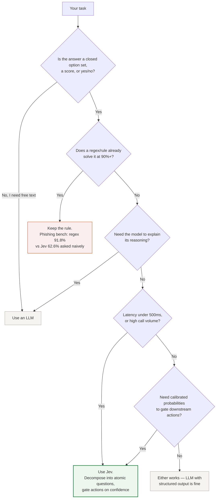

## What is Jev?

It does not generate text. You send a `state` plus typed questions; it returns structured decisions with probabilities that your code can branch on directly. Three question types, from the [official docs](https://docs.typesafe.ai/introduction):

| Primitive | Question | Returns |
|---|---|---|
| **Choice** | Pick one from up to 255 options | choice + probability distribution + confidence |
| **Score** | Rate the state on an ordered rubric | score + distribution + confidence |
| **Noul** | Is this statement true? | probability 0–1 |

Jev was released 2026-09-15 by TypeSafe AI ([launch post](https://typesafe.ai/blog/introducing-system-one-models-and-jev)). Headline figures from the [official model docs](https://docs.typesafe.ai/models), retrieved 2026-09-20: 70–500 ms latency, $0.042 per 1M input tokens, output free, up to 255 questions per call.

## Should you use Jev?

A short decision tree. One lesson shows up across the independent evals listed on the [research page](/research): asking Jev a single big vague question works poorly — the reliable pattern is to decompose the task into atomic questions and gate actions on confidence.



## Quickstart

This example follows the [official TypeSafe docs](https://docs.typesafe.ai/introduction). The commented outputs are from our own run against the live API on 2026-09-20.

```python
from typesafe_sdk import Choice, Score, Noul, TypeSafeClient

client = TypeSafeClient()

response = client.system_one(
    state="Hi, my Stripe integration keeps failing for 3 days. Help ASAP.",
    questions={
        "department": Choice(
            instructions="Which team should handle this",
            criteria={"billing": "Payment issues",
                      "technical": "Bugs or integrations",
                      "sales": "Pricing"},
        ),
        "frustration": Score(instructions="How frustrated the customer appears",
                             criteria=["Calm", "Frustrated but civil", "Very angry"]),
        "is_urgent": Noul(instructions="The message conveys urgency"),
    },
)

print(response.answers["department"].choice)      # "technical"
print(response.answers["department"].confidence)  # 0.75
print(response.answers["is_urgent"].noul)         # 0.99
```

```bash
TYPESAFE_API_KEY=ts-your-key uv run --with typesafe-sdk triage.py
```

## Cost and latency

Figures below are from the [official docs](https://docs.typesafe.ai/models) (retrieved 2026-09-20). The "193× faster / 444× cheaper" comparison in TypeSafe's launch post is self-measured; independent evaluations that confirm or qualify these claims are collected on the [research page](/research).

| | Jev | Frontier LLM (vendor's comparison) |
|---|---|---|
| Latency | **70–500 ms** | 3–329 s |
| Input price | **$0.042 / M tok** | $1–15 / M tok |
| Output price | **Free** (no text generated) | per token |
| Rate limit | 250k tok/s · 1200 req/min | varies |

**Cost formula:** `monthly $ = daily calls × avg state tokens × 30 × 0.042 / 1M` — e.g. 100k calls/day × 500 tokens → 1.5B tokens/month → **$63/month**.
