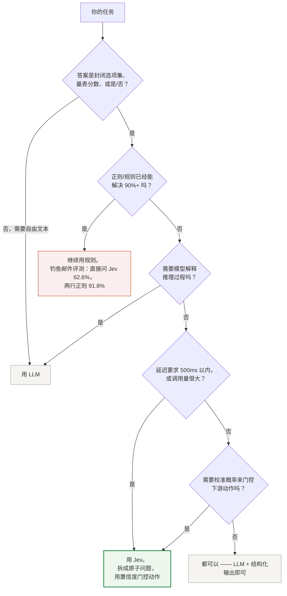

## Jev 是什么？

它不生成文本。你发送 `state`（状态）和类型化问题，它返回带概率的结构化决策，代码可以直接分支使用。三种问题类型，出自[官方文档](https://docs.typesafe.ai/introduction)：

| 原语 | 问题 | 返回 |
|---|---|---|
| **Choice** | 从最多 255 个选项中选一个 | 选项 + 概率分布 + 置信度 |
| **Score** | 在有序量表上打分 | 分数 + 分布 + 置信度 |
| **Noul** | 这条陈述为真吗？ | 0–1 概率 |

Jev 由 TypeSafe AI 于 2026-09-15 发布（[发布长文](https://typesafe.ai/blog/introducing-system-one-models-and-jev)）。核心数字出自[官方模型文档](https://docs.typesafe.ai/models)（检索于 2026-09-20）：延迟 70–500ms，输入 $0.042/百万 token，输出免费，单次调用最多 255 个问题。

## 该不该用 Jev？

一个简明的决策树。[研究页](/zh/research)列出的独立评测指向同一条经验：把一个模糊的大问题直接丢给 Jev 效果很差 —— 可靠的做法是先拆成原子问题，再用置信度门控动作。



## 快速上手

示例改写自 [TypeSafe 官方文档](https://docs.typesafe.ai/introduction)；注释中的输出是我们 2026-09-20 对真实 API 实测的结果。

```python
from typesafe_sdk import Choice, Score, Noul, TypeSafeClient

client = TypeSafeClient()

response = client.system_one(
    state="Hi, my Stripe integration keeps failing for 3 days. Help ASAP.",
    questions={
        "department": Choice(
            instructions="Which team should handle this",
            criteria={"billing": "Payment issues",
                      "technical": "Bugs or integrations",
                      "sales": "Pricing"},
        ),
        "frustration": Score(instructions="How frustrated the customer appears",
                             criteria=["Calm", "Frustrated but civil", "Very angry"]),
        "is_urgent": Noul(instructions="The message conveys urgency"),
    },
)

print(response.answers["department"].choice)      # "technical"
print(response.answers["department"].confidence)  # 0.75
print(response.answers["is_urgent"].noul)         # 0.99
```

```bash
TYPESAFE_API_KEY=ts-your-key uv run --with typesafe-sdk triage.py
```

## 成本与延迟

下表数字出自[官方文档](https://docs.typesafe.ai/models)（检索于 2026-09-20）。官方发布文中"快 193 倍 / 省 444 倍"的对比是自测口径；证实或修正这些说法的独立评测汇总在[研究页](/zh/research)。

| | Jev | 前沿 LLM（官方对比口径） |
|---|---|---|
| 延迟 | **70–500 ms** | 3–329 s |
| 输入价格 | **$0.042 / 百万 token** | $1–15 / 百万 token |
| 输出价格 | **免费**（不生成文本） | 按 token 计费 |
| 限流 | 25 万 tok/s · 1200 次/分 | 各家不同 |

**成本公式：** `月成本($) = 日调用量 × 平均 state token 数 × 30 × 0.042 / 1M` —— 例：每天 10 万次调用 × 500 token → 每月 15 亿 token → **$63/月**。
